# [Linux-Mint] 1. 리눅스 민트를 VMware에 설치해보자(1)

> 노트북이나 컴퓨터에 VMWare가 설치 되었다는 가정 하에 진행 됩니다. 
>
> 잘못된 내용이 포함되어 있을 수도 있습니다. 피드백 환영합니다!

## 1. Linux Mint ISO 파일 다운로드 받기

Linux Mint의 ISO 파일은 https://linuxmint.com/ 홈페이지에서 다운로드 받으실 수 있습니다.

해당 홈페이지에 접속하면 메인 화면이 뜨고, 홈페이지 내 Download 메뉴로 들어가시면 됩니다.

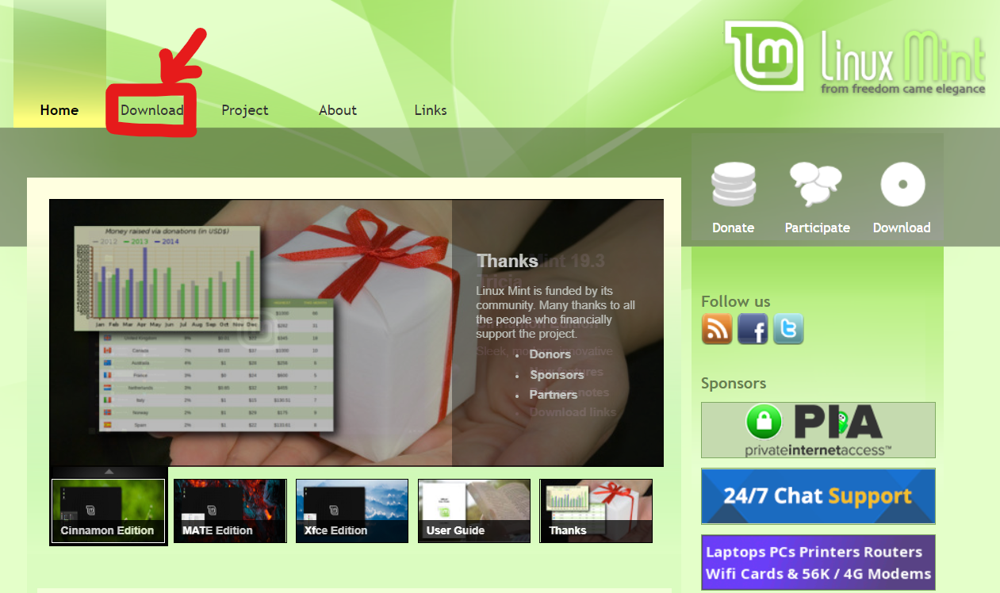

그러면 다음과 같은 홈페이지가 뜹니다.

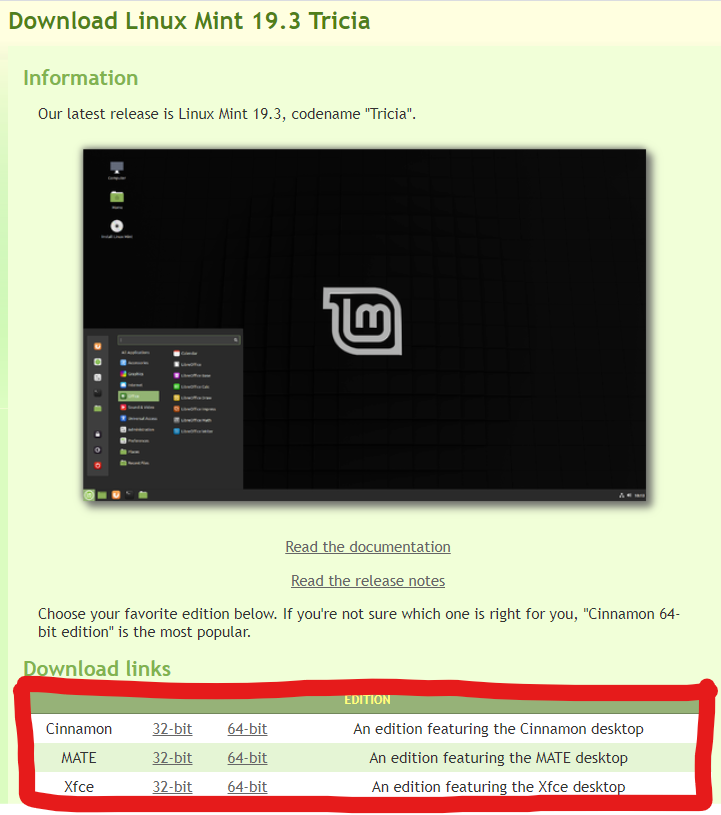 

 여기서 원하는 Edition을 다운로드 받으시면 되는데요, 저는 가장 널리 쓰인다는 "Cinnamon 64 bit" Edition을 다운로드 했습니다.

Cinnamon 행의 64-bit를 클릭하시면 다음과 같은 화면이 나오는데요,

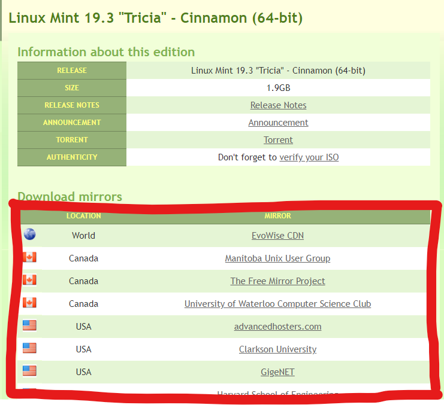

여기서 여러 미러들 중 아무거나 다운로드 받으시면 됩니다. 실제 홈페이지에는 더 많은 미러들이 있고 한국 것도 있다고 하던데 저는 아무거나 다운로드 했습니다!

## 2. ISO 인증하기

Linux Mint ISO를 다운로드 받았던 홈페이지에서 다음 빨간 박스 부분의 링크를 클릭합니다.

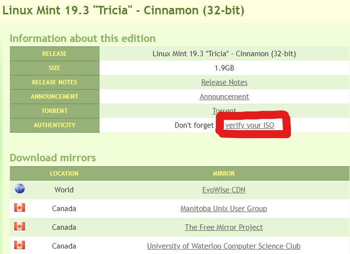

그러면 다음과 같은 화면이 뜨는데, 저는 Linux Mint 19.3 version의 ISO를 다운로드 했으니 19.3을 클릭했습니다. 

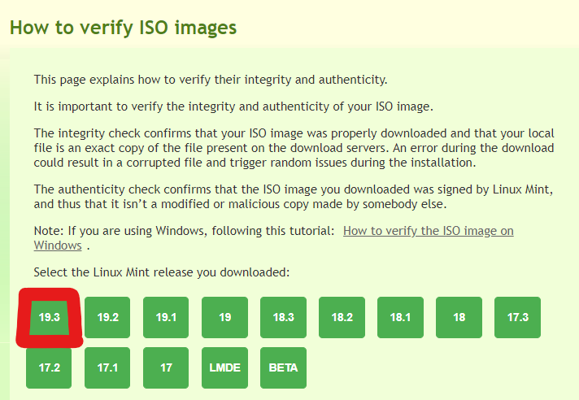

클릭하시면 Authentication 부여 방법이 상세하게 나와있습니다.

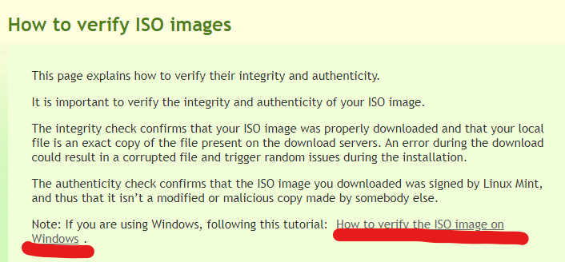

해당 페이지에서 윈도우 상에서의 Authentication 부여 방법이 상세하게 설명되어 있는 링크를 제공하고 있지만(저도 현재 Windows 사용 중입니다), 그냥 git bash를 이용하여 verify 해보도록 하겠습니다.

#### 1) Preparation

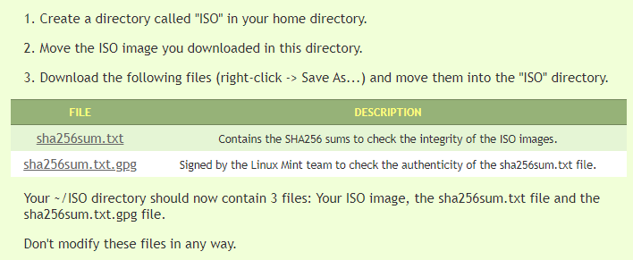

간단하게 요약하자면, "ISO"라는 폴더를 생성하고, 다운로드 받은 ISO 이미지 파일을 해당 폴더("ISO")로 이동시킨 후, 추가적으로 "sha256sum.txt", "sha256sum.txt.gpg" 파일들을 "ISO" 폴더에 다운로드 받으시면 됩니다.

그렇게 되면 "ISO" 폴더 내에는 ISO 파일, sha256.txt 파일, sha256sum.txt.gpg 파일, 총 세 가지의 파일이 들어가 있어야 하겠죠?

저는 C:\ 디렉터리 내에 "ISO"라는 이름을 가진 폴더를 생성한 후 세 파일을 옮겨 넣었습니다.

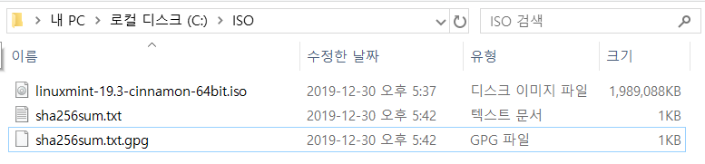

그리고 이 세 파일들을 수정하지 마시고, 다음 절차를 따라하시면 됩니다.

#### 2) Integrity check

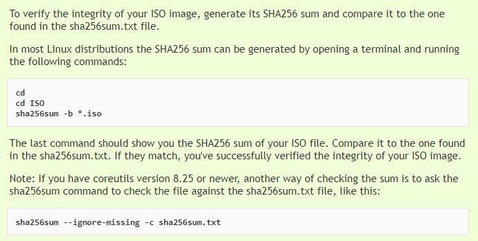

일단 cmd 창에서, 아까 만들었던 "ISO" 폴더 내로 이동한 후, 다음과 같이 명령어를 차례대로 입력하시면 됩니다. (명령어가 기니까 복사 하는 걸 추천 드립니다!)

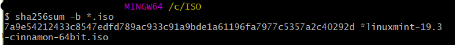

(git bash를 이용했습니다)

#### 3) Authenticity check

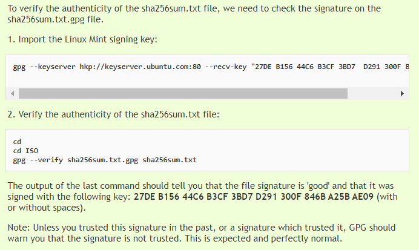

그냥 저는 cmd 창에서 "ISO" 폴더로 이동한 후 다음과 같이 입력했습니다.

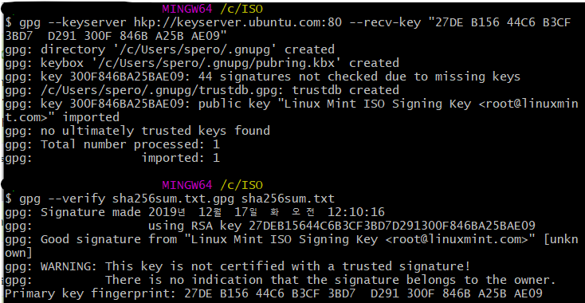

이런 식으로 맨 마지막 명령어를 입력했을 때, file signature이 'good'이며 **27DE B156 44C6 B3CF 3BD7 D291 300F 846B A25B AE09**(사이에 공백이 있을 수도, 없을 수도 있음)라는 키 값으로 signed 되었다는 결과가 나오면 됩니다.

trusted signature이 아니라는 warning 메세지가 떠도 그냥 무시해도 된답니다.

이제 ISO 다운로드를 받고, ISO 파일에 Authentication 부여까지 해보았습니다. 다음은 VMware에 본격적으로 Linux Mint를 설치해보도록 하겠습니다.